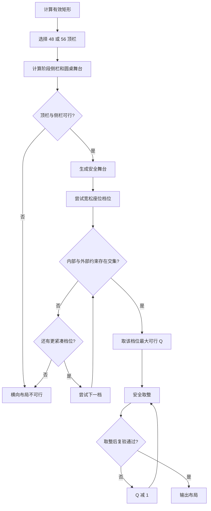

# 横向房间布局与圆桌几何模型

## 1. 文档状态

本文定义 Avalon 房间界面的目标横向布局，是不依赖具体编程语言、UI 框架或设备类别的规范模型。

“横向布局”表示布局模式已经由上层响应式模式选择器选定；本文不规定何时从其他布局切换到横向布局。当前 Web 界面尚未完整采用本文的常驻阶段侧栏，因此本文是目标规范，不是现状说明。

项目术语以 [`CONTEXT.md`](../../CONTEXT.md) 为准。本文使用其中定义的横向房间布局、圆桌舞台、圆桌布局正方形、圆形桌面、玩家中心轨道、圆桌占用包络、阶段侧栏和座位呈现档位。

## 2. 设计目标

横向布局必须同时满足以下目标：

1. 顶栏横跨可用宽度，主舞台和阶段侧栏位于顶栏下方。
2. 主要阶段操作无需页面滚动，也不依赖侧栏内部滚动才能完成。
3. 圆桌尺寸由主舞台实际可用几何决定，不使用设备名称判断。
4. 圆桌适配完整占用包络，而不只适配圆形桌面。
5. 5–10 人的头像、姓名、标记、中央信息区互不遮挡。
6. 游戏阶段和公开状态变化不改变圆桌尺寸或位置。
7. 空间不足时明确返回“横向布局不可行”，不裁切关键内容。

## 3. 几何总览


布局层级如下：

```text
有效布局矩形
├── 顶栏
└── 内容矩形
    ├── 圆桌舞台
    │   └── 安全舞台
    │       └── 圆桌占用包络
    │           ├── 圆桌布局正方形
    │           ├── 圆形桌面
    │           ├── 玩家中心轨道
    │           ├── 玩家座位
    │           └── 中央信息区
    └── 阶段侧栏
        ├── 当前阶段主要操作
        └── 最近记录
```

## 4. 坐标系和输入

### 4.1 坐标系

- 原点位于布局矩形左上角。
- X 轴向右为正。
- Y 轴向下为正。
- 角度从 X 正轴开始。
- 所有长度均为逻辑单位；平台负责将逻辑单位映射为实际像素或设备单位。

### 4.2 输入

| 符号 | 含义 |
| --- | --- |
| `W`, `H` | 原始布局矩形的宽和高 |
| `It`, `Ir`, `Ib`, `Il` | 上、右、下、左安全区 |
| `N` | 玩家人数，取值 5–10 |
| `viewerSeatIndex` | 当前观察者的座位序号 |
| `L`, `C`, `Rtop` | 顶栏左、中、右内容所需宽度 |
| `Arequired` | 所有游戏阶段中最大的主要操作高度预算 |

有效内容矩形为：

```text
Xu = Il
Yu = It
Wu = W - Il - Ir
Hu = H - It - Ib
```

背景允许延伸到原始矩形和安全区中；文字、交互控件、圆桌占用包络和阶段侧栏内容只能使用有效内容矩形。

## 5. 基准参数

这些值是目标设计的默认逻辑单位。实现可以通过主题替换整组参数，但不得单独修改某个值而跳过约束复验。

### 5.1 顶层参数

| 参数 | 默认值 | 含义 |
| --- | ---: | --- |
| `Hbreak` | 680 | 顶栏高度档位分界 |
| `Tcompact` | 48 | 紧凑顶栏高度 |
| `Tstandard` | 56 | 标准顶栏高度 |
| `Pmin` | 288 | 阶段侧栏最小宽度 |
| `Pmax` | 384 | 阶段侧栏最大宽度 |
| `α` | 0.28 | 阶段侧栏目标宽度比例 |
| `Mcompact` | 12 | 紧凑顶栏下的舞台安全边距 |
| `Mstandard` | 16 | 标准顶栏下的舞台安全边距 |
| `Gseat` | 8 | 玩家座位之间的最小间距 |
| `Gcenter` | 12 | 玩家座位与中央信息区的最小间距 |
| `Gtop` | 12 | 顶栏三区之间的最小间距 |

### 5.2 圆桌参数

| 参数 | 默认值 | 含义 |
| --- | ---: | --- |
| `Qcap` | 640 | 圆桌布局正方形边长上限 |
| `ρ` | 0.74 | 圆形桌面直径相对 `Q` 的比例 |
| `κ` | 0.43 | 玩家轨道半径相对 `Q` 的比例 |
| `Dcmin` | 152 | 中央信息区最小直径 |
| `Dcmax` | 256 | 中央信息区最大直径 |
| `γ` | 0.38 | 中央信息区直径相对 `Q` 的目标比例 |
| `Ocap` | 0.06 | 桌面圆心相对安全舞台中心的最大补偿比例 |

其中：

```text
Dt = ρQ
R  = κQ
Dc = clamp(Dcmin, γQ, Dcmax)
```

### 5.3 座位呈现档位

| 参数 | 紧凑 | 标准 | 宽松 |
| --- | ---: | ---: | ---: |
| `Q` 范围 | 0–439 | 440–559 | 560–640 |
| 头像直径 `Aavatar` | 40 | 48 | 56 |
| 姓名牌最大宽度 `Wname` | 80 | 96 | 112 |
| 姓名牌高度 `Hname` | 22 | 24 | 26 |
| 姓名字号 | 12 | 13 | 14 |
| 领袖标记上限 `Hleader` | 24 | 28 | 32 |
| 其他状态标记 | 16 | 20 | 24 |
| 最小交互热区 | 44 | 48 | 56 |

玩家姓名超过姓名牌宽度时省略显示；完整姓名通过座位详情读取。实际姓名长度不得改变圆桌几何。

## 6. 顶层布局算法

### 6.1 顶栏高度

顶栏使用离散档位，不进行无级缩放：

```text
若 Hu < Hbreak：
    T = Tcompact
    M = Mcompact
否则：
    T = Tstandard
    M = Mstandard
```

每个档位独立规定字体、图标、热区和间距。浏览器缩放、系统字号或产品级 UI 缩放负责用户级缩放；媒体布局不在两个顶栏档位之间插值。

### 6.2 阶段侧栏和圆桌舞台

```text
P  = clamp(Pmin, αWu, Pmax)
Hc = Hu - T
Ws = Wu - P
Hs = Hc
```

三个输出矩形为：

```text
TopBar  = Rect(Xu,      Yu,     Wu, T)
Stage   = Rect(Xu,      Yu + T, Ws, Hs)
Sidebar = Rect(Xu + Ws, Yu + T, P,  Hs)
```

主舞台与阶段侧栏直接相邻。视觉分隔线可以覆盖二者边界，但不额外占用布局宽度。

### 6.3 安全舞台

```text
SafeStage = inset(Stage, M, M, M, M)
```

`M` 是完整圆桌占用包络之外的最终净空。不得先给舞台增加会缩小布局内容区的内边距，再从圆桌尺寸中重复扣除 `M`。

## 7. 顶栏内部算法

顶栏分为左侧房间信息、中间任务轨道和右侧功能入口。为保证任务轨道相对整个顶栏真正居中，左右两侧使用相同的保护宽度：

```text
Sguard = max(L, Rtop)
WcenterAvailable = Wu - 2Sguard - 2Gtop
```

当 `WcenterAvailable < C` 时：

1. 若当前使用 56 高顶栏，切换到其紧凑内容组合。
2. 隐藏左右区的次要说明文字，但保留房间、阶段和可访问名称。
3. 再次计算仍不满足时，返回“横向布局不可行”。

顶栏内容压缩不能改变顶栏高度档位，也不能覆盖中间任务轨道。

## 8. 阶段侧栏算法

阶段侧栏使用内容优先，而不是固定上下比例。

设所有受支持阶段的主要操作预算为：

```text
Arequired = max(
  Ateam,
  Avote,
  Aquest,
  Aassassination,
  Aresult,
  ...
)
```

侧栏高度分配为：

```text
A = min(Hs, max(Amin, Arequired))
Lhistory = Hs - A
```

如果 `Hs < Arequired`，按以下顺序降级：

1. 隐藏最近记录正文。
2. 收起最近记录区域。
3. 删除阶段辅助说明。
4. 使用预设的紧凑操作间距。
5. 若主要操作仍不能同时显示，返回“横向布局不可行”。

投票、任务牌、刺杀确认和阶段主按钮不得依赖滚动才能完成。阶段变化不得改变 `Arequired`，因此不能在游戏中触发布局模式切换。

## 9. 圆桌坐标模型

### 9.1 玩家位置

玩家座位以观察者为相对原点。对第 `i` 个玩家：

```text
relativeIndex(i) = mod(seatIndex(i) - viewerSeatIndex, N)
θi = π/2 + relativeIndex(i) × 2π/N

Pi.x = Cx + R cos(θi)
Pi.y = Cy + R sin(θi)
```

`Pi` 是头像中心，不是整个座位容器中心。当前玩家位于六点钟方向，其他玩家按房间座位顺序顺时针排列。头像、姓名和状态标记自身的旋转角始终为零。

### 9.2 座位局部边界

以头像中心 `(0, 0)` 为座位局部坐标原点。姓名牌位于头像下方，间距 `Gname = 4`；领袖标记位于头像上方，并与头像重叠自身高度的三分之一。任务成员、断线和投票结果标记不得突破姓名牌的左右边界。

所选呈现档位的最坏情况局部边界为：

```text
Eleft   = Wname / 2
Eright  = Wname / 2
Etop    = Aavatar / 2 + 2Hleader / 3
Ebottom = Aavatar / 2 + Gname + Hname

PlayerLocalBounds = Rect(
  -Eleft,
  -Etop,
  Eleft + Eright,
  Etop + Ebottom
)
```

第 `i` 个座位的边界为：

```text
SeatBounds(i, Q) = translate(PlayerLocalBounds, Pi(Q))
```

包络按最大合法状态计算。领袖、任务成员、断线、投票结果或角色显示状态发生变化时，不重新计算座位边界。

### 9.3 圆桌占用包络

先以圆桌中心为 `(0, 0)` 构造候选几何：

```text
TabletopBounds(Q) = Rect(-Dt/2, -Dt/2, Dt, Dt)

B0(Q) = union(
  TabletopBounds(Q),
  SeatBounds(0, Q),
  ...,
  SeatBounds(N - 1, Q)
)
```

`B0(Q)` 是尚未平移的圆桌占用包络。圆桌布局正方形只是用于计算比例和玩家位置的参考坐标区，不代替实际包络。

### 9.4 包络居中

令 `center(Rect)` 返回矩形中心，则使完整包络居中的桌面圆心补偿为：

```text
Offset(Q) = center(SafeStage) - center(B0(Q))
```

必须满足：

```text
abs(Offset.x) ≤ Ocap × Q
abs(Offset.y) ≤ Ocap × Q
```

默认 `Ocap = 0.06`。这一上限能够容纳 5–10 人因奇偶座位分布和下置姓名牌产生的自然偏移；若超过上限，应调整呈现档位或标签结构，而不是继续移动桌面。

平移后的包络为：

```text
B(Q) = translate(B0(Q), Offset(Q))
```

## 10. 圆桌约束

### 10.1 外部适配约束

```text
B(Q) ⊆ SafeStage
Q ≤ Qcap
```

因为 `B(Q)` 的宽高随 `Q` 单调增加，可以求得满足外部适配约束的最大值 `Qfit`。

估算阶段可以使用：

```text
Q ≈ min(Stage.width, Stage.height) - 安全预留
```

但正式结果必须使用完整包络。安全预留只出现一次，不能同时存在于舞台内边距和圆桌尺寸公式中。

### 10.2 座位相互碰撞

弦长可以快速估算相邻玩家所需的最小轨道半径：

```text
2R sin(π/N) ≥ A + Gseat
Rrequired = (A + Gseat) / (2 sin(π/N))
Qrequired ≈ Rrequired / κ
```

其中 `A` 是座位在相邻方向上的保守占用宽度。正式判断使用实际轴对齐矩形：

```text
对任意 i ≠ j：

intersection(
  expand(SeatBounds(i), Gseat / 2),
  expand(SeatBounds(j), Gseat / 2)
) = empty
```

### 10.3 中央信息区碰撞

对每个座位矩形，计算桌面中心到该矩形的最短距离：

```text
distance(TableCenter, SeatBounds(i)) ≥ Dc/2 + Gcenter
```

点到轴对齐矩形的距离可以写为：

```text
dx = max(Rect.left - Px, 0, Px - Rect.right)
dy = max(Rect.top  - Py, 0, Py - Rect.bottom)
distance = sqrt(dx² + dy²)
```

这里 `P` 为桌面中心。该约束比统一径向延伸更准确，能够处理顶部玩家姓名向圆心延伸等非对称情况。

### 10.4 内部最小尺寸

座位碰撞、中央信息区碰撞和圆心补偿共同确定当前呈现档位的最小可行值 `Qrequired`。这些约束随 `Q` 增大而由失败转为通过。

外部包络适配确定最大可行值 `Qfit`。它随 `Q` 增大而由通过转为失败。

一个档位可行，当且仅当：

```text
max(Tier.Qmin, Qrequired)
≤
min(Tier.Qmax, Qfit, Qcap)
```

## 11. 圆桌求解算法

档位按“宽松 → 标准 → 紧凑”依次尝试。先保证信息可读，再在该档位内最大化圆桌。

```text
for tier in [宽松, 标准, 紧凑]:
    qLower = max(tier.minQ, 求内部约束的最小可行 Q)
    qUpper = min(tier.maxQ, Qcap, 求外部适配的最大可行 Q)

    if qLower ≤ qUpper:
        Qcontinuous = qUpper
        Qrender = 安全向下取整(Qcontinuous)
        构造并取整全部渲染几何

        while 取整后的几何不满足全部约束:
            Qrender = Qrender - 1
            重新构造渲染几何

        返回该档位和 Qrender

返回“横向布局不可行”
```

规范只定义约束和最大化目标，不绑定求解技术。实现可以使用解析计算、单调区间二分或预计算表；连续解与理论最大值的误差不得超过 1 个逻辑单位。



## 12. 布局稳定性

圆桌几何只能由下列输入改变：

```text
W, H, I, N, viewerSeatIndex, seat presentation tier
```

其中 `viewerSeatIndex` 只旋转座位映射，不改变 `Q`。以下状态不得改变圆桌尺寸或中心：

- 游戏阶段。
- 领袖变更。
- 任务队伍变更。
- 投票提交或公布。
- 任务牌提交或任务结果。
- 侧栏说明文字变化。
- 标记显示和隐藏。

玩家人数在等待开局时变化可以重新求解；游戏开始后玩家人数固定。

## 13. 安全取整

连续数学结果映射为离散逻辑单位时采用方向明确的取整规则：

- 受上界约束的尺寸向下取整。
- 受下界约束的热区和间距向上取整。
- 位置坐标就近取整。
- 三角函数、包络和碰撞计算完成后才取整。
- 取整后重新执行包含、座位碰撞、中央碰撞和补偿上限检查。
- 若复验失败，将相关尺寸向安全方向调整 1 个逻辑单位并再次验证。

形式上，最终 `Q` 是不超过连续解的最大离散可行值：

```text
Qrender = max { q ∈ integers | q ≤ Qcontinuous 且 RoundedLayout(q) 可行 }
```

## 14. 横向布局可行性

横向布局只有在以下条件全部满足时才可用：

```text
Wu > 0 且 Hu > 0
顶栏三区满足最小内容宽度
P ≥ Pmin
Hs ≥ Arequired
至少一个座位呈现档位存在可行 Q
主要操作同时可见
所有最终取整几何通过复验
```

任一条件失败时，返回结构化结果：

```text
feasible = false
reason ∈ {
  insufficient-topbar-width,
  insufficient-sidebar-height,
  insufficient-stage-space,
  seat-collision,
  center-collision,
  excessive-center-offset
}
```

该结果交给后续响应式模式选择器处理。横向布局本身不选择移动端、竖屏或其他替代模式。

## 15. 计算示例

以下示例假设安全区均为 0，顶栏和阶段侧栏内容预算已满足。`Q*` 是连续求解值，括号内为安全取整后的 `Qrender`。包络尺寸为取整前结果，保留两位小数。

| 可用尺寸 | 人数 | 顶栏 | 侧栏 `P` | 舞台 `Ws×Hs` | 档位 | `Q*`（最终） | `Dt` | `R` | 包络 `宽×高` | 圆心补偿 Y |
| --- | ---: | ---: | ---: | ---: | --- | ---: | ---: | ---: | ---: | ---: |
| 1250×605 | 5 | 48 | 350 | 900×557 | 标准 | 559.00（559） | 413.66 | 240.37 | 553.21×529.50 | -27.62 |
| 1250×605 | 10 | 48 | 350 | 900×557 | 标准 | 509.69（509） | 377.17 | 219.17 | 512.88×533.00 | -4.67 |
| 1366×768 | 5 | 56 | 382.48 | 983.52×712 | 宽松 | 640.00（640） | 473.60 | 275.20 | 635.46×605.17 | -30.61 |
| 1366×768 | 10 | 56 | 382.48 | 983.52×712 | 宽松 | 640.00（640） | 473.60 | 275.20 | 635.46×657.73 | -4.33 |
| 1440×900 | 5 | 56 | 384 | 1056×844 | 宽松 | 640.00（640） | 473.60 | 275.20 | 635.46×605.17 | -30.61 |
| 1440×900 | 10 | 56 | 384 | 1056×844 | 宽松 | 640.00（640） | 473.60 | 275.20 | 635.46×657.73 | -4.33 |
| 1920×1080 | 5 | 56 | 384 | 1536×1024 | 宽松 | 640.00（640） | 473.60 | 275.20 | 635.46×605.17 | -30.61 |
| 1920×1080 | 10 | 56 | 384 | 1536×1024 | 宽松 | 640.00（640） | 473.60 | 275.20 | 635.46×657.73 | -4.33 |
| 1024×768 | 5 | 56 | 288 | 736×712 | 宽松 | 640.00（640） | 473.60 | 275.20 | 635.46×605.17 | -30.61 |
| 1024×768 | 10 | 56 | 288 | 736×712 | 宽松 | 640.00（640） | 473.60 | 275.20 | 635.46×657.73 | -4.33 |

1250×605 的 10 人示例说明了完整包络算法与“舞台短边减一点边距”的关系：舞台高度为 557，安全舞台高度为 533，最终包络高度恰好受 533 限制；圆形桌面直径约为 377，而不是使用旧式 `557 - 208` 得到过小结果。

## 16. 诊断显示

规范图和布局调试模式应能独立显示以下边界：

- 原始布局矩形。
- 有效布局矩形。
- 顶栏、主舞台和阶段侧栏矩形。
- 安全舞台。
- 圆桌布局正方形 `Q`。
- 圆形桌面 `Dt`。
- 玩家中心轨道 `R`。
- 每个玩家的 `SeatBounds`。
- 完整圆桌占用包络 `B(Q)`。

这些边界用于解释和验算模型。正式游戏 UI 默认不显示；只有设计或调试模式可以开启。

## 17. 验收规则

每个实现至少验证以下输入：

```text
1250×605
1366×768
1440×900
1920×1080
1024×768
```

每个尺寸分别验证 5 人和 10 人，并检查：

1. 顶栏档位、阶段侧栏宽度和主舞台矩形符合公式。
2. 当前玩家位于六点钟方向，座位顺序为视觉顺时针。
3. `Q` 不超过 640，座位呈现档位符合 `Q` 范围。
4. 完整包络位于安全舞台内。
5. 玩家座位之间的间距不少于 `Gseat`。
6. 玩家座位与中央信息区的间距不少于 `Gcenter`。
7. 桌面圆心补偿不超过 `0.06Q`。
8. 所有玩家内容保持屏幕正向。
9. 最小交互热区符合所选档位。
10. 阶段和状态切换不改变圆桌尺寸与中心。
11. 主要操作无需滚动即可完成。
12. 不可行输入返回明确原因，而不是产生裁切或重叠。

## 18. 与当前 Web 实现的关系

当前 Web 已经具备以下相同基础：

- 圆桌布局正方形最大边长为 640。
- 圆形桌面直径约为 `0.74Q`。
- 玩家中心轨道半径约为 `0.43Q`。
- 当前玩家固定在底部，其他玩家顺时针排列。
- 圆桌、头像和姓名具有响应式约束和浏览器几何回归测试。

主要差异是：

- 当前界面没有本文定义的常驻阶段侧栏。
- 当前玩家座位尺寸主要使用连续区间缩放；本文改为三个离散呈现档位。
- 当前实现包含多组针对高度和人数的位移修正；本文以完整包络求解替代重复预留和经验位移。

采用本文模型属于后续实现任务，必须另行制定迁移计划和回归范围；本文本身不授权修改现有游戏 UI。
