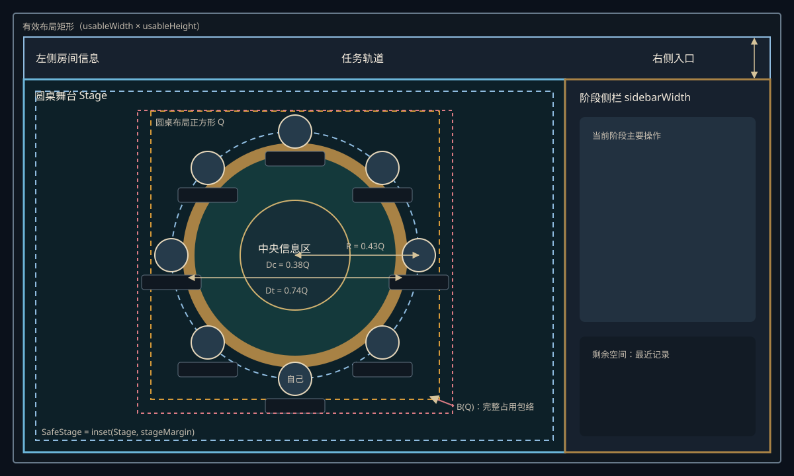
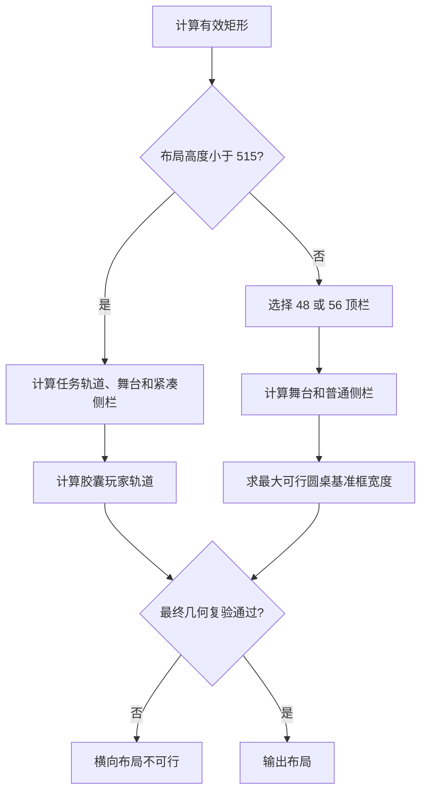

# 横向房间布局与圆桌几何模型

## 1. 文档状态

本文定义 Avalon 房间界面的目标横向布局，是不依赖具体编程语言、UI 框架或设备类别的规范模型。

“横向布局”表示布局模式已经由上层响应式模式选择器选定；本文不规定何时从其他布局切换到横向布局。当前 Web 界面尚未完整采用本文的常驻阶段侧栏，因此本文是目标规范，不是现状说明。

项目术语以 [`CONTEXT.md`](../../CONTEXT.md) 为准。本文使用其中定义的横向房间布局、圆桌舞台、圆桌布局基准框、桌面、玩家中心轨道、圆桌占用包络、阶段侧栏和座位呈现档位。

可在浏览器中打开[统一横竖屏交互原型](./prototypes/avalon-landscape-responsive-lab.html)，通过预设尺寸、自定义宽高或旋转按钮检查普通横版、紧凑横版与竖版布局。

竖向模式的三段结构、紧凑/普通两档固定区域和内部座位呈现档位由[竖向布局规范](./vertical-layout.md)定义；两种方向共用同一个交互原型。

## 2. 设计目标

横向布局必须同时满足以下目标：

1. 普通横版使用横跨可用宽度的顶栏；低高度紧凑横版改用左侧任务轨道，为圆桌保留完整高度。
2. 主要阶段操作无需页面滚动，也不依赖侧栏内部滚动才能完成。
3. 圆桌尺寸由主舞台实际可用几何决定，不使用设备名称判断。
4. 圆桌适配完整占用包络，而不只适配圆形桌面。
5. 5–10 人的头像、姓名、标记、中央信息区互不遮挡。
6. 游戏阶段和公开状态变化不改变圆桌尺寸或位置。
7. 空间不足时明确返回“横向布局不可行”，不裁切关键内容。

## 3. 几何总览



上图展示普通横版；紧凑横版的三列矩形和胶囊玩家轨道由 6.4 节和 9.2 节定义。

布局层级如下：

```text
有效布局矩形
├── 普通横版
│   ├── 顶栏
│   └── 内容矩形
│       ├── 圆桌舞台
│       └── 阶段侧栏
└── 紧凑横版
    ├── 返回按钮与纵向任务轨道
    ├── 圆桌舞台
    └── 阶段侧栏

圆桌舞台
└── 安全舞台
    └── 圆桌占用包络
        ├── 圆形桌面
        ├── 玩家中心轨道
        ├── 玩家座位
        └── 中央信息区
```

## 4. 坐标系和输入

### 4.1 坐标系

- 原点位于布局矩形左上角。
- X 轴向右为正。
- Y 轴向下为正。
- 角度从 X 正轴开始。
- 所有长度均为逻辑单位；平台负责将逻辑单位映射为实际像素或设备单位。

### 4.2 输入

| 变量 | 含义 |
| --- | --- |
| `layoutWidth`, `layoutHeight` | 原始布局矩形的宽和高 |
| `insetTop`, `insetRight`, `insetBottom`, `insetLeft` | 上、右、下、左安全区 |
| `playerCount` | 玩家人数，取值 5–10 |
| `viewerSeatIndex` | 当前观察者的座位序号 |
| `leftContentWidth`, `taskTrackWidth`, `rightContentWidth` | 普通顶栏左、中、右内容所需宽度 |
| `requiredActionHeight` | 所有游戏阶段中最大的主要操作高度预算 |

有效内容矩形为：

```text
usableX = insetLeft
usableY = insetTop
usableWidth = layoutWidth - insetLeft - insetRight
usableHeight = layoutHeight - insetTop - insetBottom
```

背景允许延伸到原始矩形和安全区中；文字、交互控件、圆桌占用包络和阶段侧栏内容只能使用有效内容矩形。

## 5. 基准参数

这些值是目标设计的默认逻辑单位。实现可以通过主题替换整组参数，但不得单独修改某个值而跳过约束复验。

### 5.1 顶层参数

| 参数 | 默认值 | 含义 |
| --- | ---: | --- |
| `compactLayoutHeightBreak` | 515 | 低于该布局高度时使用紧凑横版 |
| `topBarHeightBreak` | 680 | 普通横版顶栏高度档位分界 |
| `compactTopBarHeight` | 48 | 普通横版的紧凑顶栏高度 |
| `standardTopBarHeight` | 56 | 普通横版的标准顶栏高度 |
| `sidebarMinWidth` | 288 | 普通横版阶段侧栏最小宽度 |
| `sidebarMaxWidth` | 384 | 普通横版阶段侧栏最大宽度 |
| `sidebarRatio` | 0.28 | 阶段侧栏目标宽度比例 |
| `compactTaskRailWidth` | 56 | 紧凑横版纵向任务轨道宽度 |
| `compactSidebarNarrowBreak` | 720 | 紧凑阶段侧栏窄宽档位分界 |
| `compactSidebarNarrowWidth` | 192 | 窄宽紧凑阶段侧栏宽度 |
| `compactSidebarMinWidth` | 224 | 常规紧凑阶段侧栏最小宽度 |
| `compactSidebarMaxWidth` | 288 | 常规紧凑阶段侧栏最大宽度 |
| `compactTopBarStageMargin` | 12 | 普通横版使用 48 高顶栏时的舞台安全边距 |
| `standardTopBarStageMargin` | 16 | 普通横版使用 56 高顶栏时的舞台安全边距 |
| `compactLayoutStageMargin` | 8 | 紧凑横版的舞台安全边距 |
| `seatGap` | 8 | 玩家座位之间的最小间距 |
| `centerGap` | 12 | 玩家座位与中央信息区的最小间距 |
| `topBarGap` | 12 | 普通顶栏三区之间的最小间距 |

### 5.2 圆桌参数

| 参数 | 默认值 | 含义 |
| --- | ---: | --- |
| `roundTableFrameWidthCap` | 640 | 圆形布局基准框边长上限 |
| `tabletopDiameterScale` | 0.74 | 圆形桌面直径相对基准框宽度的比例 |
| `playerOrbitRadiusScale` | 0.43 | 玩家轨道半径相对基准框宽度的比例 |
| `centerPanelDiameterMin` | 152 | 中央信息区最小直径 |
| `centerPanelDiameterMax` | 256 | 中央信息区最大直径 |
| `centerPanelDiameterScale` | 0.38 | 中央信息区直径相对基准框宽度的目标比例 |
| `tabletopCenterOffsetScaleCap` | 0.06 | 桌面圆心相对安全舞台中心的最大补偿比例 |

其中：

```text
tabletopDiameter = tabletopDiameterScale × roundTableFrameWidth
playerOrbitRadius = playerOrbitRadiusScale × roundTableFrameWidth
centerPanelDiameter = clamp(
    centerPanelDiameterMin,
    centerPanelDiameterScale × roundTableFrameWidth,
    centerPanelDiameterMax
)
```

### 5.3 座位呈现档位

| 参数 | 紧凑 | 标准 | 宽松 |
| --- | ---: | ---: | ---: |
| `roundTableFrameWidth` 范围 | 0–439 | 440–559 | 560–640 |
| 头像直径 `avatarDiameter` | 40 | 48 | 56 |
| 姓名牌最大宽度 `nameWidth` | 80 | 96 | 112 |
| 姓名牌高度 `nameHeight` | 22 | 24 | 26 |
| 姓名字号 | 12 | 13 | 14 |
| 领袖标记上限 `leaderCrownHeight` | 24 | 28 | 32 |
| 其他状态标记 | 16 | 20 | 24 |
| 最小交互热区 | 44 | 48 | 56 |

玩家姓名超过姓名牌宽度时省略显示；完整姓名通过座位详情读取。实际姓名长度不得改变圆桌几何。

## 6. 顶层布局算法

### 6.1 横版模式

横版内部只按有效高度选择模式，不按设备名称选择：

```text
layoutMode = layoutHeight < compactLayoutHeightBreak
    ? compactLandscape
    : normalLandscape
```

`layoutHeight = 515` 时进入普通横版。本文只定义横版内部模式；横屏是否可用仍由上层响应式模式选择器决定。

### 6.2 普通横版顶栏高度

顶栏使用离散档位，不进行无级缩放：

```text
若 layoutHeight < topBarHeightBreak：
    topBarHeight = compactTopBarHeight
    stageMargin = compactTopBarStageMargin
否则：
    topBarHeight = standardTopBarHeight
    stageMargin = standardTopBarStageMargin
```

每个档位独立规定字体、图标、热区和间距。浏览器缩放、系统字号或产品级 UI 缩放负责用户级缩放；媒体布局不在两个顶栏档位之间插值。

### 6.3 普通横版矩形

```text
sidebarWidth = clamp(sidebarMinWidth, sidebarRatio × usableWidth, sidebarMaxWidth)
contentHeight = usableHeight - topBarHeight
stageWidth = usableWidth - sidebarWidth
stageHeight = contentHeight
```

三个输出矩形为：

```text
TopBar  = Rect(usableX,              usableY,                usableWidth,  topBarHeight)
Stage   = Rect(usableX,              usableY + topBarHeight, stageWidth,   stageHeight)
Sidebar = Rect(usableX + stageWidth, usableY + topBarHeight, sidebarWidth, stageHeight)
```

主舞台与阶段侧栏直接相邻。视觉分隔线可以覆盖二者边界，但不额外占用布局宽度。

### 6.4 紧凑横版矩形

紧凑横版取消顶栏，从左到右依次放置纵向任务轨道、圆桌舞台和阶段侧栏：

```text
taskRailWidth = compactTaskRailWidth

sidebarWidth = layoutWidth < compactSidebarNarrowBreak
    ? compactSidebarNarrowWidth
    : clamp(compactSidebarMinWidth, sidebarRatio × usableWidth, compactSidebarMaxWidth)

stageWidth = usableWidth - taskRailWidth - sidebarWidth
stageHeight = usableHeight
```

三个输出矩形为：

```text
TaskRail = Rect(usableX,                              usableY, taskRailWidth, usableHeight)
Stage    = Rect(usableX + taskRailWidth,              usableY, stageWidth,   stageHeight)
Sidebar  = Rect(usableX + taskRailWidth + stageWidth, usableY, sidebarWidth, stageHeight)
```

`compactTaskRailWidth = 56` 已包含任务列表的左右内边距；舞台计算不得再次扣除这部分空间。阶段侧栏与舞台直接相邻，边界线不得额外占用布局宽度。

### 6.5 安全舞台

```text
stageMargin = layoutMode == compactLandscape
    ? compactLayoutStageMargin
    : stageMarginForSelectedTopBar
```

```text
SafeStage = inset(Stage, stageMargin, stageMargin, stageMargin, stageMargin)
```

`stageMargin` 是完整圆桌占用包络之外的最终净空。不得先给舞台增加会缩小布局内容区的内边距，再从圆桌尺寸中重复扣除 `stageMargin`。

边框属于渲染细节。若实现使用会占据内部尺寸的边框，应先取得画布内容矩形，再把该内容矩形作为本文的原始布局矩形；通用模型中不直接出现 `-2px` 之类的边框修正。

## 7. 顶栏和任务轨道内部算法

### 7.1 普通横版顶栏

本节只适用于普通横版。顶栏分为左侧房间信息、中间任务轨道和右侧功能入口。为保证任务轨道相对整个顶栏真正居中，左右两侧使用相同的保护宽度：

```text
guardWidth = max(leftContentWidth, rightContentWidth)
availableTaskTrackWidth = usableWidth - 2 × guardWidth - 2 × topBarGap
```

当 `availableTaskTrackWidth < taskTrackWidth` 时：

1. 若当前使用 56 高顶栏，切换到其紧凑内容组合。
2. 隐藏左右区的次要说明文字，但保留房间、阶段和可访问名称。
3. 再次计算仍不满足时，返回“横向布局不可行”。

顶栏内容压缩不能改变顶栏高度档位，也不能覆盖中间任务轨道。

### 7.2 紧凑横版任务轨道

紧凑横版将返回按钮和五个任务放在宽度为 `compactTaskRailWidth` 的纵向轨道中：

```text
backAreaHeight = 44
dividerHeight = 1
taskButtonSize = 44
taskGap = clamp(8, layoutHeight × 0.025, 12)
taskGroupHeight = 5 × taskButtonSize + 4 × taskGap
taskGroupOffsetY = (usableHeight - backAreaHeight - dividerHeight - taskGroupHeight) / 2
```

任务组在返回区以下的剩余高度内整体居中，不均匀分配全部剩余空间。任务列表宽度为 56，左右内边距各 4；44 宽任务热区因此左右各有 6 的轨道净空。任务人数和“双失败”规则最多两个次要图标，共用圆形任务节点底部的单行信息条；成功或失败仍使用节点颜色和右上角结果图标表达。

## 8. 阶段侧栏算法

阶段侧栏使用内容优先，而不是固定上下比例。

设所有受支持阶段的主要操作预算为：

```text
requiredActionHeight = max(
  teamActionHeight,
  voteActionHeight,
  questActionHeight,
  assassinationActionHeight,
  resultActionHeight,
  ...
)
```

侧栏高度分配为：

```text
actionAreaHeight = min(stageHeight, max(minActionHeight, requiredActionHeight))
historyHeight = stageHeight - actionAreaHeight
```

如果 `stageHeight < requiredActionHeight`，按以下顺序降级：

1. 隐藏最近记录正文。
2. 收起最近记录区域。
3. 删除阶段辅助说明。
4. 使用预设的紧凑操作间距。
5. 若主要操作仍不能同时显示，返回“横向布局不可行”。

投票、任务牌、刺杀确认和阶段主按钮不得依赖滚动才能完成。阶段变化不得改变 `requiredActionHeight`，因此不能在游戏中触发布局模式切换。

## 9. 圆桌坐标模型

### 9.1 普通横版玩家位置

玩家座位以观察者为相对原点。对第 `i` 个玩家：

```text
relativeIndex(i) = mod(seatIndex(i) - viewerSeatIndex, playerCount)
playerSeatAngle(i) = π/2 + relativeIndex(i) × 2π/playerCount

playerSeatCenter(i).x =
    tabletopCenter.x
    + playerOrbitRadius × cos(playerSeatAngle(i))

playerSeatCenter(i).y =
    tabletopCenter.y
    + playerOrbitRadius × sin(playerSeatAngle(i))
```

`playerSeatCenter` 是头像中心，不是整个座位容器中心。当前玩家位于六点钟方向，其他玩家按房间座位顺序顺时针排列。头像、姓名和状态标记自身的旋转角始终为零。

### 9.2 紧凑横版玩家位置

紧凑横版使用水平胶囊形玩家轨道。它由上下两段直线和左右两个半圆组成，比椭圆更能利用低高度舞台的横向空间。尺寸为：

```text
seatWidth = clamp(72, layoutHeight × 0.213, 88)
seatHeight = 0.825 × seatWidth
avatarDiameter = clamp(38, layoutHeight × 0.107, 46)

orbitWidth = max(
    220,
    min(layoutHeight × 0.88, stageWidth - seatWidth - 2 × compactLayoutStageMargin)
)
orbitHeight = min(layoutHeight × 0.656, orbitWidth)
tableDiameter = min(layoutHeight × 0.544, orbitHeight × 0.83)
```

玩家沿胶囊周长等距排列：

```text
playerSeatCenter(i) =
    stageCenter
    + stadiumPoint(relativeIndex(i), playerCount, orbitWidth, orbitHeight)
```

`stadiumPoint` 表示从六点钟方向开始、按视觉顺时针沿胶囊周长等距取点。该函数只负责轨道取点，不改变头像、姓名或标记的屏幕方向。

紧凑横版的保守占用包络为：

```text
footprintWidth = orbitWidth + seatWidth
footprintHeight = orbitHeight + seatHeight
```

最终仍以所有实际 `PlayerSeatBounds` 与桌面边界的并集复验，保守包络不能替代碰撞检查。

### 9.3 座位局部边界

以头像中心 `(0, 0)` 为座位局部坐标原点。姓名牌位于头像下方，间距 `nameGap = 4`；领袖标记位于头像上方，并与头像重叠自身高度的三分之一。任务成员、断线和投票结果标记不得突破姓名牌的左右边界。

所选呈现档位的最坏情况局部边界为：

```text
seatLeftExtent = nameWidth / 2
seatRightExtent = nameWidth / 2
seatTopExtent = avatarDiameter / 2 + 2 × leaderCrownHeight / 3
seatBottomExtent = avatarDiameter / 2 + nameGap + nameHeight

PlayerSeatLocalBounds = Rect(
    -seatLeftExtent,
    -seatTopExtent,
    seatLeftExtent + seatRightExtent,
    seatTopExtent + seatBottomExtent
)
```

第 `i` 个座位的边界为：

```text
PlayerSeatBounds(i, roundTableFrameWidth) =
    translate(
        PlayerSeatLocalBounds,
        playerSeatCenter(i, roundTableFrameWidth)
    )
```

`PlayerSeatBounds` 是稳定的最坏合法状态边界。每个座位都预留完整领袖皇冠和状态标记空间，即使当前未显示这些标记；领袖轮换、任务成员选择和连接状态变化不得改变座位几何。诊断线、碰撞检查和圆桌占用包络必须引用同一边界。

包络按最大合法状态计算。领袖、任务成员、断线、投票结果或角色显示状态发生变化时，不重新计算座位边界。

### 9.4 圆桌占用包络

先以圆桌中心为 `(0, 0)` 构造候选几何：

```text
TabletopBounds(roundTableFrameWidth) = Rect(
    -tabletopDiameter / 2,
    -tabletopDiameter / 2,
    tabletopDiameter,
    tabletopDiameter
)

UnshiftedRoundTableFootprint(roundTableFrameWidth) = union(
    TabletopBounds(roundTableFrameWidth),
    PlayerSeatBounds(0, roundTableFrameWidth),
    ...,
    PlayerSeatBounds(playerCount - 1, roundTableFrameWidth)
)
```

`UnshiftedRoundTableFootprint` 是尚未平移的圆桌占用包络。圆桌布局基准框只是用于计算比例和玩家位置的参考坐标区，不代替实际包络；在普通横版中它是正方形。

### 9.5 包络居中

令 `center(Rect)` 返回矩形中心，则使完整包络居中的桌面圆心补偿为：

```text
tabletopCenterOffset(roundTableFrameWidth) =
    center(SafeStage)
    - center(UnshiftedRoundTableFootprint(roundTableFrameWidth))
```

必须满足：

```text
abs(tabletopCenterOffset.x)
    ≤ tabletopCenterOffsetScaleCap × roundTableFrameWidth

abs(tabletopCenterOffset.y)
    ≤ tabletopCenterOffsetScaleCap × roundTableFrameWidth
```

默认 `tabletopCenterOffsetScaleCap = 0.06`。这一上限能够容纳 5–10 人因奇偶座位分布和下置姓名牌产生的自然偏移；若超过上限，应调整呈现档位或标签结构，而不是继续移动桌面。

平移后的包络为：

```text
RoundTableFootprint(roundTableFrameWidth) = translate(
    UnshiftedRoundTableFootprint(roundTableFrameWidth),
    tabletopCenterOffset(roundTableFrameWidth)
)
```

## 10. 圆桌约束

### 10.1 外部适配约束

```text
RoundTableFootprint(roundTableFrameWidth) ⊆ SafeStage
roundTableFrameWidth ≤ roundTableFrameWidthCap
```

因为 `RoundTableFootprint` 的宽高随 `roundTableFrameWidth` 单调增加，可以求得满足外部适配约束的最大值 `fittingRoundTableFrameWidth`。

估算阶段可以使用：

```text
roundTableFrameWidth ≈
    min(stageWidth, stageHeight)
    - safetyAllowance
```

但正式结果必须使用完整包络。安全预留只出现一次，不能同时存在于舞台内边距和圆桌尺寸公式中。

### 10.2 座位相互碰撞

弦长可以快速估算相邻玩家所需的最小轨道半径：

```text
2 × playerOrbitRadius × sin(π / playerCount)
    ≥ adjacentSeatSpan + seatGap

requiredPlayerOrbitRadius =
    (adjacentSeatSpan + seatGap)
    / (2 × sin(π / playerCount))

requiredRoundTableFrameWidth ≈
    requiredPlayerOrbitRadius / playerOrbitRadiusScale
```

其中 `adjacentSeatSpan` 是座位在相邻方向上的保守占用宽度。正式判断使用实际轴对齐矩形。先定义两个边界的横向和纵向分离量：

```text
horizontalBoundarySeparation =
    max(
        secondBounds.left - firstBounds.right,
        firstBounds.left - secondBounds.right
    )

verticalBoundarySeparation =
    max(
        secondBounds.top - firstBounds.bottom,
        firstBounds.top - secondBounds.bottom
    )

adjacentBoundaryGap =
    max(
        horizontalBoundarySeparation,
        verticalBoundarySeparation
    )
```

因此任意两个玩家座位的正式约束为：

```text
adjacentBoundaryGap(
    PlayerSeatBounds(firstPlayer),
    PlayerSeatBounds(secondPlayer)
) ≥ seatGap
```

这与“横向或纵向至少一个方向具有完整间距”的轴对齐碰撞语义等价。竖向跑道使用同一度量优化视觉间距；普通横版和紧凑横版仍可按既定等轨道间隔放置玩家中心。

### 10.3 中央信息区碰撞

对每个座位矩形，计算桌面中心到该矩形的最短距离：

```text
distance(tabletopCenter, PlayerSeatBounds(i))
    ≥ centerPanelDiameter / 2 + centerGap
```

点到轴对齐矩形的距离可以写为：

```text
horizontalDistance = max(
    playerSeatBounds.left - tabletopCenter.x,
    0,
    tabletopCenter.x - playerSeatBounds.right
)

verticalDistance = max(
    playerSeatBounds.top - tabletopCenter.y,
    0,
    tabletopCenter.y - playerSeatBounds.bottom
)

tabletopDistance = sqrt(horizontalDistance² + verticalDistance²)
```

该约束比统一径向延伸更准确，能够处理顶部玩家姓名向圆心延伸等非对称情况。

### 10.4 内部最小尺寸

座位碰撞、中央信息区碰撞和圆心补偿共同确定当前呈现档位的最小可行值 `requiredRoundTableFrameWidth`。这些约束随 `roundTableFrameWidth` 增大而由失败转为通过。

外部包络适配确定最大可行值 `fittingRoundTableFrameWidth`。它随 `roundTableFrameWidth` 增大而由通过转为失败。

一个档位可行，当且仅当：

```text
max(tierMinimumRoundTableFrameWidth, requiredRoundTableFrameWidth)
≤
min(
    tierMaximumRoundTableFrameWidth,
    fittingRoundTableFrameWidth,
    roundTableFrameWidthCap
)
```

## 11. 圆桌求解算法

### 11.1 普通横版

档位按“宽松 → 标准 → 紧凑”依次尝试。先保证信息可读，再在该档位内最大化圆桌。

```text
for tier in [宽松, 标准, 紧凑]:
    candidateMinimumFrameWidth = max(
        tierMinimumRoundTableFrameWidth,
        求内部约束的最小可行 roundTableFrameWidth
    )
    candidateMaximumFrameWidth = min(
        tierMaximumRoundTableFrameWidth,
        roundTableFrameWidthCap,
        求外部适配的最大可行 roundTableFrameWidth
    )

    if candidateMinimumFrameWidth ≤ candidateMaximumFrameWidth:
        continuousRoundTableFrameWidth = candidateMaximumFrameWidth
        renderedRoundTableFrameWidth =
            安全向下取整(continuousRoundTableFrameWidth)
        构造并取整全部渲染几何

        while 取整后的几何不满足全部约束:
            renderedRoundTableFrameWidth =
                renderedRoundTableFrameWidth - 1
            重新构造渲染几何

        返回该档位和 renderedRoundTableFrameWidth

返回“横向布局不可行”
```

规范只定义约束和最大化目标，不绑定求解技术。实现可以使用解析计算、单调区间二分或预计算表；连续解与理论最大值的误差不得超过 1 个逻辑单位。

### 11.2 紧凑横版

紧凑横版不使用圆形玩家轨道的 `roundTableFrameWidth` 求解器。它按 9.2 节公式直接计算 `seatWidth`、`orbitWidth` 和 `orbitHeight`，再执行以下约束：

```text
RoundTableFootprint ⊆ SafeStage
所有 PlayerSeatBounds 互不重叠
所有 PlayerSeatBounds 与中央信息区保持 centerGap
```

若约束失败，返回“横向布局不可行”，不得继续缩小到低于既定座位、头像或 44×44 交互热区的下限。



## 12. 布局稳定性

圆桌几何只能由下列输入改变：

```text
layoutWidth, layoutHeight, safeInsets, playerCount, viewerSeatIndex, seatTier
```

其中 `viewerSeatIndex` 只旋转座位映射，不改变 `roundTableFrameWidth`。以下状态不得改变圆桌尺寸或中心：

- 游戏阶段。
- 领袖变更。
- 任务队伍变更。
- 投票提交或公布。
- 任务牌提交或任务结果。
- 侧栏说明文字变化。
- 标记显示和隐藏。

玩家人数在等待开局时变化可以重新求解；游戏开始后玩家人数固定。

## 13. 安全取整

连续数学结果映射为离散逻辑单位时采用方向明确的取整规则：

- 受上界约束的尺寸向下取整。
- 受下界约束的热区和间距向上取整。
- 位置坐标就近取整。
- 三角函数、包络和碰撞计算完成后才取整。
- 取整后重新执行包含、座位碰撞、中央碰撞和补偿上限检查。
- 若复验失败，将相关尺寸向安全方向调整 1 个逻辑单位并再次验证。

形式上，最终的 `renderedRoundTableFrameWidth` 是不超过连续解的最大离散可行值：

```text
renderedRoundTableFrameWidth = max {
    candidateFrameWidth ∈ integers
    | candidateFrameWidth ≤ continuousRoundTableFrameWidth
    且 RoundedLayout(candidateFrameWidth) 可行
}
```

## 14. 横向布局可行性

横向布局只有在以下条件全部满足时才可用：

```text
usableWidth > 0 且 usableHeight > 0
普通横版时，顶栏三区满足最小内容宽度
sidebarWidth 满足当前横版模式的宽度公式
stageHeight ≥ requiredActionHeight
普通横版至少存在一个可行 roundTableFrameWidth；紧凑横版的胶囊轨道通过复验
主要操作同时可见
所有最终取整几何通过复验
```

任一条件失败时，返回结构化结果：

```text
feasible = false
reason ∈ {
  insufficient-topbar-width,
  insufficient-sidebar-height,
  insufficient-stage-space,
  seat-collision,
  center-collision,
  excessive-center-offset
}
```

该结果交给后续响应式模式选择器处理。横向布局本身不选择移动端、竖屏或其他替代模式。

## 15. 计算示例

以下示例假设安全区均为 0，顶栏和阶段侧栏内容预算已满足。`continuousRoundTableFrameWidth` 是连续求解值，括号内为安全取整后的 `renderedRoundTableFrameWidth`。包络尺寸为取整前结果，保留两位小数。

| 可用尺寸 | 人数 | 顶栏 | `sidebarWidth` | `stageWidth × stageHeight` | 档位 | 基准框宽度（最终） | 桌面直径 | 玩家轨道半径 | 包络 `宽×高` | 圆心补偿 Y |
| --- | ---: | ---: | ---: | ---: | --- | ---: | ---: | ---: | ---: | ---: |
| 1250×605 | 5 | 48 | 350 | 900×557 | 标准 | 559.00（559） | 413.66 | 240.37 | 553.21×529.50 | -27.62 |
| 1250×605 | 10 | 48 | 350 | 900×557 | 标准 | 509.69（509） | 377.17 | 219.17 | 512.88×533.00 | -4.67 |
| 1366×768 | 5 | 56 | 382.48 | 983.52×712 | 宽松 | 640.00（640） | 473.60 | 275.20 | 635.46×605.17 | -30.61 |
| 1366×768 | 10 | 56 | 382.48 | 983.52×712 | 宽松 | 640.00（640） | 473.60 | 275.20 | 635.46×657.73 | -4.33 |
| 1440×900 | 5 | 56 | 384 | 1056×844 | 宽松 | 640.00（640） | 473.60 | 275.20 | 635.46×605.17 | -30.61 |
| 1440×900 | 10 | 56 | 384 | 1056×844 | 宽松 | 640.00（640） | 473.60 | 275.20 | 635.46×657.73 | -4.33 |
| 1920×1080 | 5 | 56 | 384 | 1536×1024 | 宽松 | 640.00（640） | 473.60 | 275.20 | 635.46×605.17 | -30.61 |
| 1920×1080 | 10 | 56 | 384 | 1536×1024 | 宽松 | 640.00（640） | 473.60 | 275.20 | 635.46×657.73 | -4.33 |
| 1024×768 | 5 | 56 | 288 | 736×712 | 宽松 | 640.00（640） | 473.60 | 275.20 | 635.46×605.17 | -30.61 |
| 1024×768 | 10 | 56 | 288 | 736×712 | 宽松 | 640.00（640） | 473.60 | 275.20 | 635.46×657.73 | -4.33 |

1250×605 的 10 人示例说明了完整包络算法与“舞台短边减一点边距”的关系：舞台高度为 557，安全舞台高度为 533，最终包络高度恰好受 533 限制；圆形桌面直径约为 377，而不是使用旧式 `557 - 208` 得到过小结果。

紧凑横版的最小尺寸示例为：

```text
usableWidth = 667
usableHeight = 375
taskRailWidth = 56
sidebarWidth = 192
stageWidth = 667 - 56 - 192 = 419
stageHeight = 375

seatWidth = 79.875
orbitWidth = min(330, 419 - 79.875 - 16) = 323.125
footprintWidth = 323.125 + 79.875 = 403
horizontalClearance = (419 - 403) / 2 = 8
```

如果具体实现的画布边框占据内容尺寸，应先把边框从原始布局矩形中扣除，再代入本例。当前预览使用左右各 1 的内部边框，因此其 `usableWidth = 665`、`stageWidth = 417`、`orbitWidth = 321.125`、`footprintWidth = 401`，最终左右净空仍各为 8。

## 16. 诊断显示

规范图和布局调试模式应能独立显示以下边界：

- 原始布局矩形。
- 有效布局矩形。
- 顶栏、主舞台和阶段侧栏矩形。
- 紧凑横版的任务轨道矩形。
- 安全舞台。
- 圆桌布局基准框。
- 圆形桌面 `tabletopDiameter`。
- 普通横版的圆形玩家轨道 `playerOrbitRadius` 或紧凑横版的胶囊玩家轨道。
- 每个玩家包含领袖皇冠预留的 `PlayerSeatBounds`。
- 普通横版或紧凑横版的完整 `RoundTableFootprint`。

这些边界用于解释和验算模型。正式游戏 UI 默认不显示；只有设计或调试模式可以开启。

## 17. 验收规则

每个实现至少验证以下输入：

```text
1250×605
1366×768
1440×900
1920×1080
1024×768
932×430
852×393
844×390
667×375
```

每个尺寸分别验证 5 人和 10 人，并检查：

1. 横版模式、顶栏或任务轨道、阶段侧栏宽度和主舞台矩形符合公式。
2. 当前玩家位于六点钟方向，座位顺序为视觉顺时针。
3. 普通横版的 `roundTableFrameWidth` 不超过 640 并符合座位呈现档位；紧凑横版的胶囊轨道尺寸符合公式。
4. 完整包络位于安全舞台内。
5. 玩家座位之间的间距不少于 `seatGap`。
6. 玩家座位与中央信息区的间距不少于 `centerGap`。
7. 普通横版的桌面圆心补偿不超过 `0.06 × roundTableFrameWidth`；紧凑横版的完整包络保持居中并位于安全舞台内。
8. 所有玩家内容保持屏幕正向。
9. 最小交互热区符合所选档位。
10. 阶段和状态切换不改变圆桌尺寸与中心。
11. 主要操作无需滚动即可完成。
12. 不可行输入返回明确原因，而不是产生裁切或重叠。

## 18. 与当前 Web 实现的关系

当前 Web 已经具备以下相同基础：

- 圆形布局基准框最大边长为 640。
- 圆形桌面直径约为 `0.74 × roundTableFrameWidth`。
- 玩家中心轨道半径约为 `0.43 × roundTableFrameWidth`。
- 当前玩家固定在底部，其他玩家顺时针排列。
- 圆桌、头像和姓名具有响应式约束和浏览器几何回归测试。

主要差异是：

- 当前界面没有本文定义的常驻阶段侧栏。
- 当前玩家座位尺寸主要使用连续区间缩放；本文改为三个离散呈现档位。
- 当前实现包含多组针对高度和人数的位移修正；本文以完整包络求解替代重复预留和经验位移。

采用本文模型属于后续实现任务，必须另行制定迁移计划和回归范围；本文本身不授权修改现有游戏 UI。
